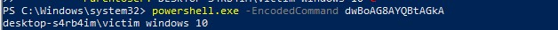
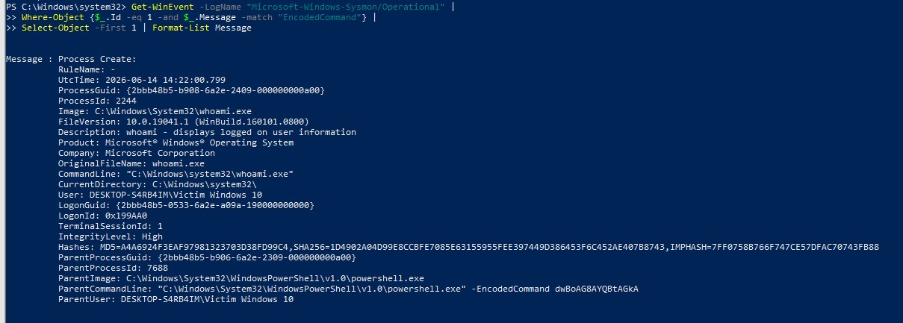
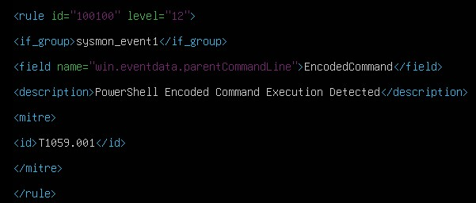
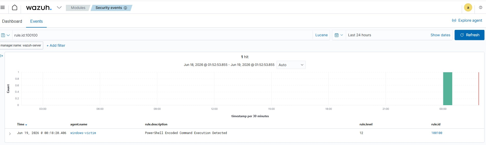
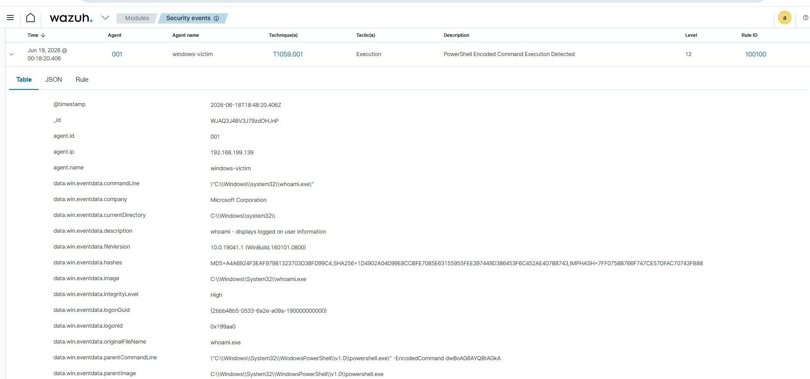

# PowerShell Encoded Command Detection

## Objective

The objective of this lab is to detect PowerShell encoded command execution using Sysmon and a custom Wazuh detection rule.

## MITRE ATT&CK Mapping

| Tactic    | Technique  | ID        |
| --------- | ---------- | --------- |
| Execution | PowerShell | T1059.001 |

## Lab Environment

* Wazuh Manager (Ubuntu)
* Windows 10 Endpoint
* Wazuh Agent
* Sysmon
* VMware Workstation

## Attack Simulation

The following PowerShell command was executed on the Windows endpoint:

```powershell
powershell.exe -EncodedCommand dwBoAG8AYQBtAGkA
```

The Base64 encoded string decodes to:

```powershell
whoami
```

## Detection Logic

A custom Wazuh rule was created to identify PowerShell executions containing the `-EncodedCommand` parameter.

### Custom Wazuh Rule

```xml
<rule id="100100" level="12">
  <if_group>sysmon</if_group>
  <field name="win.eventdata.parentCommandLine">EncodedCommand</field>
  <description>PowerShell Encoded Command Execution Detected</description>
  <mitre>
    <id>T1059.001</id>
  </mitre>
</rule>
```

## Sysmon Evidence

Sysmon Event ID 1 captured the process creation event and recorded:

* Parent Process: powershell.exe
* Child Process: whoami.exe
* Command Line: powershell.exe -EncodedCommand
* User Context: Victim Windows 10

## Wazuh Alert

The custom detection rule successfully generated an alert when the encoded PowerShell command was executed.

Alert Details:

* Rule ID: 100100
* Severity Level: 12
* MITRE ATT&CK: T1059.001
* Description: PowerShell Encoded Command Execution Detected

## Investigation Findings

The execution was identified as a PowerShell encoded command, a technique commonly used by attackers to obfuscate malicious activity and evade detection.

During the investigation:

* PowerShell launched the command using the `-EncodedCommand` parameter.
* Sysmon recorded the process creation activity.
* Wazuh correlated the event and generated a high-severity alert.
* The activity was mapped to MITRE ATT&CK technique T1059.001.

## Recommendations

* Enable PowerShell logging and transcription.
* Monitor PowerShell encoded commands.
* Restrict PowerShell execution where possible.
* Implement application control policies.
* Continuously review Sysmon and Wazuh alerts.

## Screenshots

### Attack Execution



### Sysmon Evidence



### Custom Wazuh Detection Rule



### Wazuh Alert



### Investigation View


