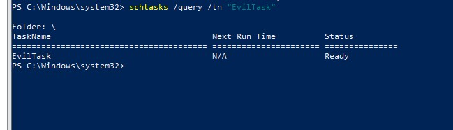
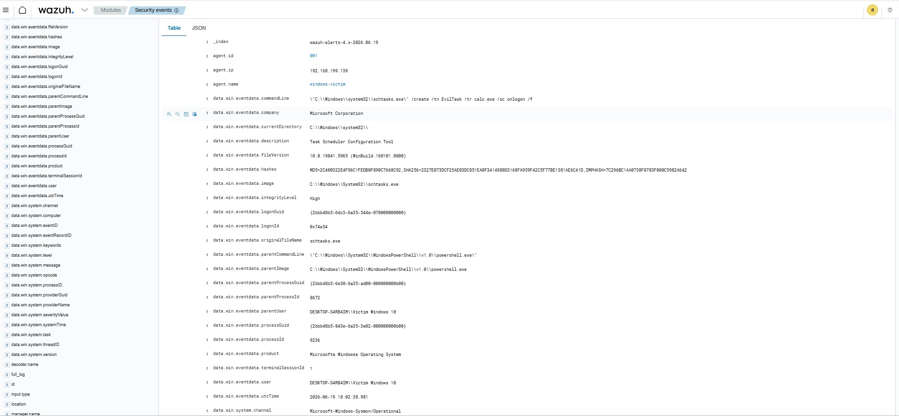
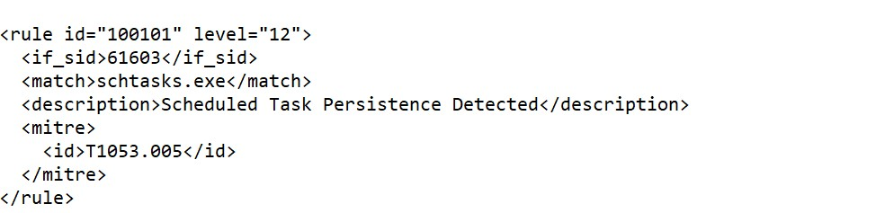
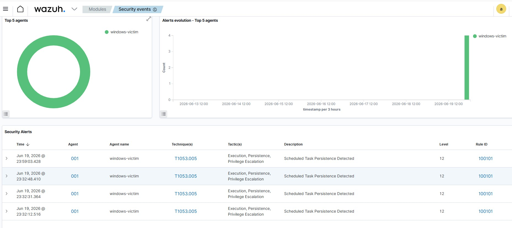

# Scheduled Task Persistence Detection - T1053.005

## Overview

This lab demonstrates detection of Windows Scheduled Task Persistence using Sysmon and Wazuh.

An attacker can create a scheduled task to execute a program automatically at user logon, system startup, or a specific time. This technique is commonly used for persistence.

## MITRE ATT&CK Mapping

| Technique ID | Technique          |
| ------------ | ------------------ |
| T1053.005    | Scheduled Task/Job |

---

## Lab Environment

* Wazuh Manager (Ubuntu Server)
* Windows 10 Endpoint
* Wazuh Agent
* Sysmon
* VMware Workstation

---

## Attack Execution

Command executed on the Windows endpoint:

```powershell
schtasks /create /tn "EvilTask" /tr "calc.exe" /sc onlogon /f
```

This creates a scheduled task named **EvilTask** that launches **calc.exe** whenever a user logs on.

---

## Sysmon Evidence

Sysmon Event ID: **1 (Process Creation)**

Key Artifacts:

```text
Image: C:\Windows\System32\schtasks.exe

CommandLine:
"C:\Windows\system32\schtasks.exe" /create /tn EvilTask /tr calc.exe /sc onlogon /f

Parent Image:
C:\Windows\System32\WindowsPowerShell\v1.0\powershell.exe

User:
DESKTOP-S4RB4IM\Victim Windows 10
```

---

## Custom Wazuh Detection Rule

Rule ID: **100101**

```xml
<rule id="100101" level="12">
  <if_sid>61603</if_sid>
  <match>schtasks.exe</match>
  <description>Scheduled Task Persistence Detected</description>
  <mitre>
    <id>T1053.005</id>
  </mitre>
</rule>
```

---

## Wazuh Alert Generated

Alert Details:

```text
Rule ID: 100101

Description:
Scheduled Task Persistence Detected

MITRE ATT&CK:
T1053.005

Rule Level:
12

Agent:
windows-victim
```

---

## Investigation Findings

The alert confirmed execution of `schtasks.exe` used to create a scheduled task named **EvilTask**.

Evidence showed:

* Process creation via Sysmon Event ID 1
* Execution from PowerShell
* Scheduled task persistence mechanism
* Successful detection by custom Wazuh rule

---

## Screenshots

### Attack Execution


### Scheduled Task Verification



### Sysmon Evidence



### Custom Wazuh Rule



### Wazuh Alert



---

## Skills Demonstrated

* Detection Engineering
* Threat Hunting
* Sysmon Log Analysis
* Wazuh Rule Development
* MITRE ATT&CK Mapping
* Security Monitoring
* Incident Investigation

---

## Outcome

Successfully detected Scheduled Task Persistence (T1053.005) using Sysmon process creation logs and a custom Wazuh detection rule.
