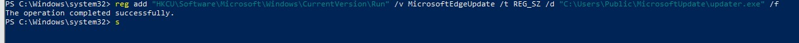
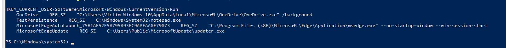
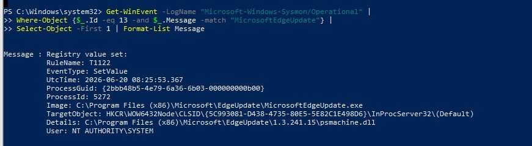
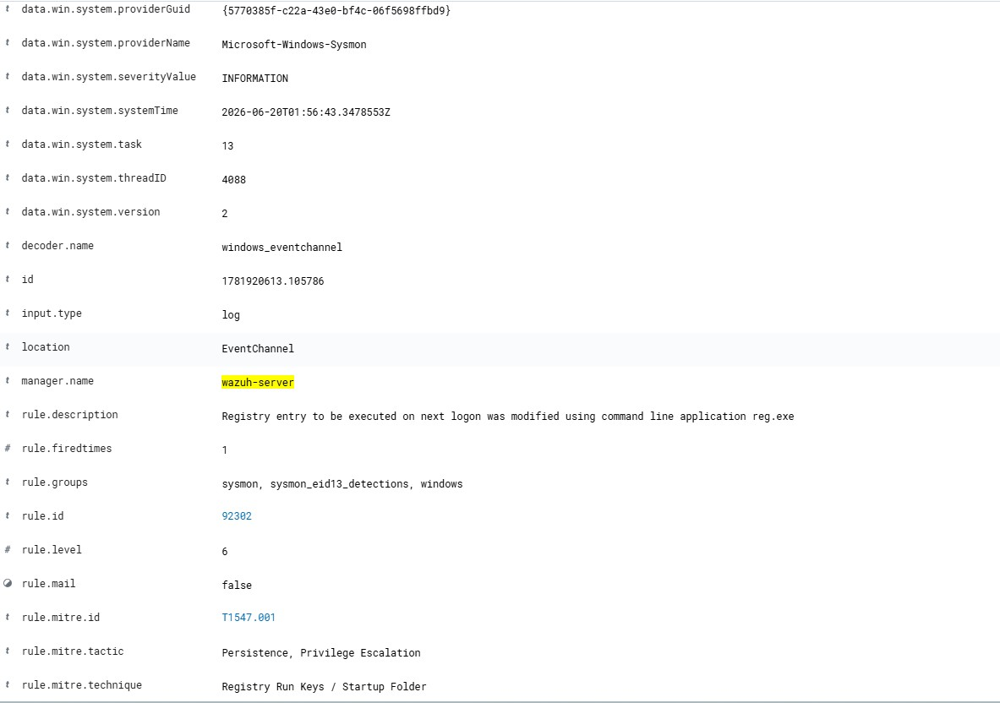

# Lab 03 – Registry Run Key Persistence Detection

## Objective

Detect and investigate Registry Run Key persistence using Sysmon and Wazuh.

This lab simulates an attacker establishing persistence by creating a Registry Run Key that automatically executes a disguised executable whenever a user logs in.

---

## MITRE ATT&CK Mapping

| Technique                          | ID        |
| ---------------------------------- | --------- |
| Registry Run Keys / Startup Folder | T1547.001 |
| Masquerading                       | T1036     |

---

## Attack Scenario

An attacker places a file named `updater.exe` in a public directory and creates a Registry Run Key named `MicrosoftEdgeUpdate` to make the executable launch automatically at user logon.

### Create Fake Payload

```powershell
mkdir C:\Users\Public\MicrosoftUpdate

copy C:\Windows\System32\notepad.exe C:\Users\Public\MicrosoftUpdate\updater.exe
```

### Create Registry Persistence

```powershell
reg add "HKCU\Software\Microsoft\Windows\CurrentVersion\Run" /v MicrosoftEdgeUpdate /t REG_SZ /d "C:\Users\Public\MicrosoftUpdate\updater.exe" /f
```

---

## Verification

Verify the Registry Run Key:

```powershell
reg query "HKCU\Software\Microsoft\Windows\CurrentVersion\Run"
```

Expected result:

```text
MicrosoftEdgeUpdate    REG_SZ    C:\Users\Public\MicrosoftUpdate\updater.exe
```

---

## Sysmon Evidence

Sysmon Event ID:

```text
13 - Registry Value Set
```

Evidence collected:

```text
Image: C:\Windows\system32\reg.exe

TargetObject:
HKCU\Software\Microsoft\Windows\CurrentVersion\Run\MicrosoftEdgeUpdate

Details:
C:\Users\Public\MicrosoftUpdate\updater.exe
```

---

## Wazuh Detection

Wazuh successfully detected the persistence activity.

### Rule Information

```text
Rule ID: 92302
```

```text
Registry entry to be executed on next logon was modified using command line application reg.exe
```

### MITRE Mapping

```text
T1547.001
Registry Run Keys / Startup Folder
```

---

## Investigation Findings

### Suspicious Indicators

| Indicator       | Observation                                 |
| --------------- | ------------------------------------------- |
| Registry Key    | MicrosoftEdgeUpdate                         |
| Executable Path | C:\Users\Public\MicrosoftUpdate\updater.exe |
| Process         | reg.exe                                     |
| Event ID        | Sysmon Event ID 13                          |
| MITRE Technique | T1547.001                                   |

### Why It Is Suspicious

* Uses a Run Key for persistence.
* Stores executable inside `C:\Users\Public`.
* Masquerades as a Microsoft update component.
* Automatically executes after user logon.

---

## Screenshots

### Attack Execution



### Registry Key Created



### Sysmon Evidence



### Wazuh Alert



---

## Outcome

Successfully simulated and detected Registry Run Key persistence using Sysmon and Wazuh.

The activity was mapped to MITRE ATT&CK technique T1547.001 and generated a Wazuh alert that can be investigated by SOC analysts.
